# KDEX Core Authorization System

This document outlines the comprehensive authorization and access control system implemented in KDEX Core.

## Overview

KDEX Core implements a hierarchical role-based access control (RBAC) system that extends Uniswap V2's original authorization model with new Infinite Liquidity Pool (ILP) functionality. The system ensures secure management of protocol parameters, fee configurations, and automated operations through clearly defined roles and permissions.

## Authorization Hierarchy

```mermaid
graph TD
    A["Factory Owner<br/>(feeToSetter)"] --> B[UniswapV2Factory]
    A --> C["Set ILP Manager Address"]
    A --> D["Set Pair ILP Fee Admin"]
    A --> E["Set Pair ILP Fee Manager"]
    A --> F["Set Protocol feeTo"]
    A --> G["Transfer Ownership"]
    
    H["ILP Manager Owner"] --> I[ILPManager Contract]
    H --> J["Set ILP Manager Admin"]
    
    K["ILP Manager Admin"] --> I
    K --> L["Set Treasury Address"]
    K --> M["Set Threshold Value"]
    K --> N["Set Processing Fee Rate"]
    K --> O["Set Upkeep Caller"]
    
    P["Upkeep Caller<br/>(Automation)"] --> I
    P --> Q["Execute performUpkeep"]
    
    R["Pair ILP Fee Admin"] --> S[UniswapV2Pair]
    R --> T["Toggle ILP Fee Status<br/>(Enable/Disable)"]
    
    U["Pair ILP Fee Manager"] --> S
    U --> V["Set ILP Fee Rates<br/>(0-200 basis points)"]
    
    B --> W["Create Trading Pairs"]
    B --> X["Store Admin Mappings"]
    
    I --> Y["Collect ILP Fees"]
    I --> Z["Process Liquidity"]
    
    S --> AA["Handle Swaps"]
    S --> BB["Collect ILP Fees"]
    
    style A fill:#ff9999
    style H fill:#ff9999
    style K fill:#ffcc99
    style R fill:#99ccff
    style U fill:#99ccff
    style P fill:#ccffcc
```



## Roles and Permissions

### 1. Factory Level Roles

#### Factory Owner (`feeToSetter`)
- **Scope**: System-wide administration
- **Powers**:
  - Set ILP Manager contract address
  - Assign ILP Fee Administrators per trading pair
  - Assign ILP Fee Managers per trading pair
  - Set protocol fee recipient
  - Transfer factory ownership
- **Key Functions**:
  ```solidity
  setIlpManagerAddress(address _newManager)
  setPairILPFeeAdmin(address _pair, address _admin)
  setPairILPFeeManager(address _pair, address _manager)
  setFeeTo(address _feeTo)
  setFeeToSetter(address _feeToSetter)
  ```

### 2. ILP Manager Roles

#### ILP Manager Owner
- **Scope**: ILP Manager contract administration
- **Powers**: Assign ILP Manager Admin role
- **Key Functions**:
  ```solidity
  setIlpManagerAdmin(address _newAdmin)
  ```

#### ILP Manager Admin
- **Scope**: ILP operational parameters
- **Powers**:
  - Configure treasury address for fee collection
  - Set threshold values for automation triggers
  - Configure processing fee rates
  - Authorize automation callers
- **Key Functions**:
  ```solidity
  setIlpTreasuryAddress(address _newAddress)
  setThresholdValue(uint _newThreshold)
  setProcessingFeeRate(uint _newRate)
  setUpkeepCaller(address _newCaller)
  ```

#### Upkeep Caller
- **Scope**: Automated operations execution
- **Powers**: Execute automated liquidity provisioning
- **Key Functions**:
  ```solidity
  performUpkeep(bytes calldata data)
  ```

### 3. Pair Level Roles

#### Pair ILP Fee Admin
- **Scope**: Per-pair ILP fee activation
- **Powers**: Enable/disable ILP fees for assigned trading pair
- **Key Functions**:
  ```solidity
  toggleIlpFeeStatus(bool _status)
  ```

#### Pair ILP Fee Manager
- **Scope**: Per-pair ILP fee configuration
- **Powers**: Set ILP fee rates (0-200 basis points) for assigned trading pair
- **Key Functions**:
  ```solidity
  setIlpFeeRates(uint _token0InRate, uint _token1InRate)
  ```

## Authorization Matrix

| Role | Factory Admin | ILP Config | Pair Fee Toggle | Pair Fee Rates | Automation | Contract Creation |
|------|---------------|------------|----------------|----------------|------------|-------------------|
| **Factory Owner** | ✅ | Assign Roles | ❌ | ❌ | ❌ | ✅ |
| **ILP Manager Owner** | ❌ | Assign Admin | ❌ | ❌ | ❌ | ❌ |
| **ILP Manager Admin** | ❌ | ✅ | ❌ | ❌ | ❌ | ❌ |
| **Pair ILP Fee Admin** | ❌ | ❌ | ✅ | ❌ | ❌ | ❌ |
| **Pair ILP Fee Manager** | ❌ | ❌ | ❌ | ✅ | ❌ | ❌ |
| **Upkeep Caller** | ❌ | ❌ | ❌ | ❌ | ✅ | ❌ |

### Legend
- ✅ **Full Access**: Complete control over the function/feature
- **Assign Roles**: Can assign other roles but not directly control the feature
- ❌ **No Access**: Cannot access or control the function/feature

## Security Features

### Access Control Mechanisms
1. **Strict Modifier Enforcement**: All admin functions use `require()` statements to verify caller identity
2. **Role Separation**: Different roles for different functions prevent privilege escalation
3. **Per-Pair Granularity**: ILP fee controls are managed individually for each trading pair
4. **Rate Validation**: Fee rates are capped at 200 basis points (2.0%) maximum
5. **Contract Validation**: ILP Manager validates calling contracts through factory verification

### Key Security Principles
- **Principle of Least Privilege**: Each role has only the minimum permissions needed
- **Separation of Concerns**: Fee management separated from operational controls
- **Fail-Safe Defaults**: ILP fees are disabled by default, must be explicitly enabled
- **Granular Control**: Per-pair authorization allows fine-tuned management

## Operational Examples

### Setting Up a New Trading Pair with ILP

1. **Factory Owner** creates the pair and assigns administrators:
   ```typescript
   await factory.setPairILPFeeAdmin(pairAddress, adminAddress);
   await factory.setPairILPFeeManager(pairAddress, managerAddress);
   ```

2. **Pair ILP Fee Manager** configures fee rates:
   ```typescript
   await pair.connect(manager).setIlpFeeRates(50, 75); // 0.5% and 0.75%
   ```

3. **Pair ILP Fee Admin** enables ILP fees:
   ```typescript
   await pair.connect(admin).toggleIlpFeeStatus(true);
   ```

### ILP Automation Setup

1. **ILP Manager Owner** assigns admin:
   ```typescript
   await ilpManager.setIlpManagerAdmin(adminAddress);
   ```

2. **ILP Manager Admin** configures automation:
   ```typescript
   await ilpManager.setUpkeepCaller(automationService);
   await ilpManager.setThresholdValue(ethers.parseEther("1000"));
   await ilpManager.setProcessingFeeRate(100); // 1%
   ```

## Error Messages

The authorization system uses clear error messages for debugging:

- `"UniswapV2: FORBIDDEN"` - Unauthorized access to factory or pair functions
- `"ILPManager: FORBIDDEN"` - Unauthorized access to ILP Manager functions
- `"UniswapV2: INVALID_FEE_RATE"` - Fee rate exceeds maximum of 200 basis points

## Integration Notes

- **Frontend Integration**: Check role assignments before displaying admin interfaces
- **Automation Setup**: Ensure upkeep callers are properly authorized before deployment
- **Multi-sig Compatibility**: All admin functions are compatible with multi-signature wallets
- **Upgradeability**: Role assignments can be updated to support contract upgrades

---

For deployment instructions and operational procedures, see the main [README.md](README.md) and [DEPLOYMENT.md](DEPLOYMENT.md).